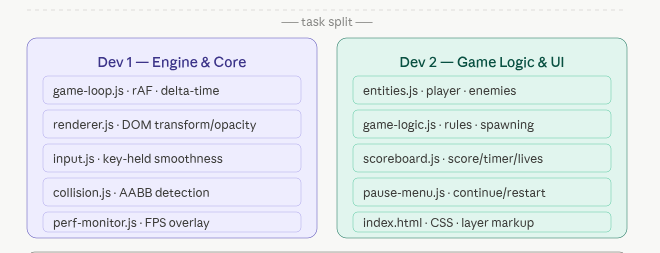

# 👾 Space Invaders: Zero-Canvas DOM Engine
  
*A highly optimized, 60 FPS, vanilla JavaScript game engine built entirely from scratch using pure DOM manipulation.*

 

## 🌠 The Vision

The goal of this project is to build a high-performance **Space Invaders** clone without relying on `<canvas>`, WebGL, or any external libraries. By mastering `requestAnimationFrame`, delta-time calculations, and hardware-accelerated CSS transforms, we achieve a butter-smooth **60 FPS** experience using only standard DOM nodes.

---

## 🏗️ System Architecture

To ensure parallel development and zero merge conflicts, the codebase is strictly separated into two domains: **The Core Engine** and **The Game Logic**.

## ⚔️ Tactical Task Distribution

*The exact file and module split between Developer 1 and Developer 2, generated directly from our Excalidraw planning.*

---

## 🚀 Key Features & Constraints

- ⚡ **Strict 60 FPS Engine**: Built to avoid Layout Thrashing and Repaint bottlenecks.
- 🎯 **Delta-Time Consistency**: Game speed remains identical regardless of monitor refresh rates.
- 🎨 **Minimal Layer Strategy**: Restricting z-indexes and stacking contexts for peak DOM performance.
- ⌨️ **Flawless Input**: Continuous keyboard polling bypasses OS-level key-repeat delays.
